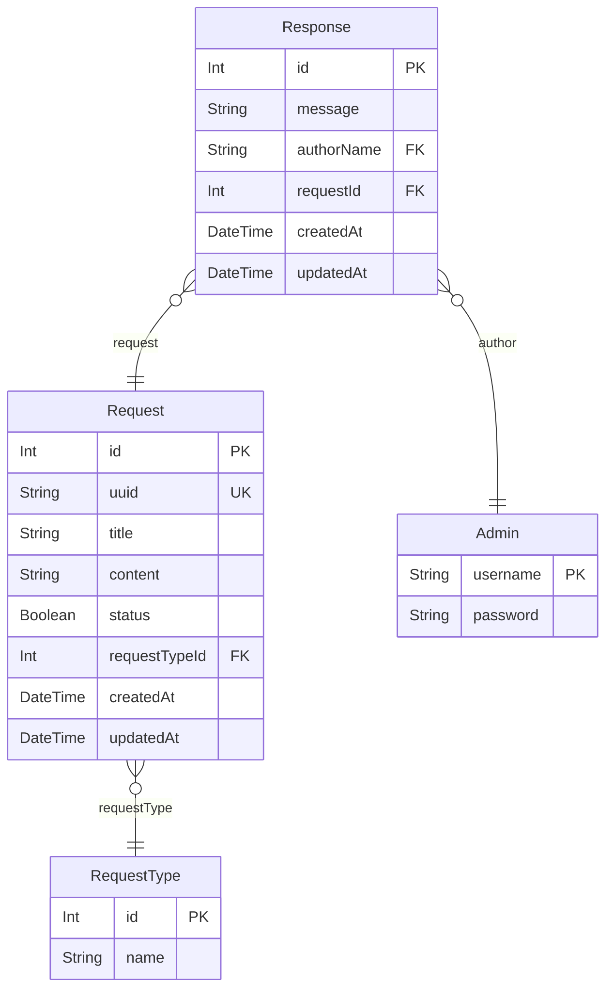

# SAYEM Yazılım Geliştirici 5 Database Entity Relationship Diagram

### `Request(Talep)`

**Properties**
  - `id`: Primary Key INT
  - `uuid`: Unique Key server tarafında generate edilir STRING
  - `title`: Talep başlık STRING(191).
  - `content`: Talep içerik LONGTEXT
  - `status`: Talep durumu BOOLEAN
  - `requestTypeId`: Talep türü Foreign Key INT
  - `createdAt`: Talep oluşturulma tarihi DATETIME
  - `updatedAt`: Talep Düzenleme tarihi DATETIME

### `RequestType(Talep Türü)`

**Properties**
  - `id`: Primary Key INT
  - `name`: Talep türü STRING(191)

### `Admin(Yetkili)`

**Properties**
  - `username`: Primary Key STRING
  - `password`: Şifre STRING

### `Response(Cevap)`

**Properties**
  - `id`: Primary Key INT
  - `message`: Cevap mesajı LONGTEXT
  - `authorName`: Cevap veren yetkili username Foreign Key STRING
  - `requestId`: Talep ID Foreign Key INT
  - `createdAt`: Talep oluşturulma tarihi DATETIME
  - `updatedAt`: Talep Düzenleme tarihi DATETIME