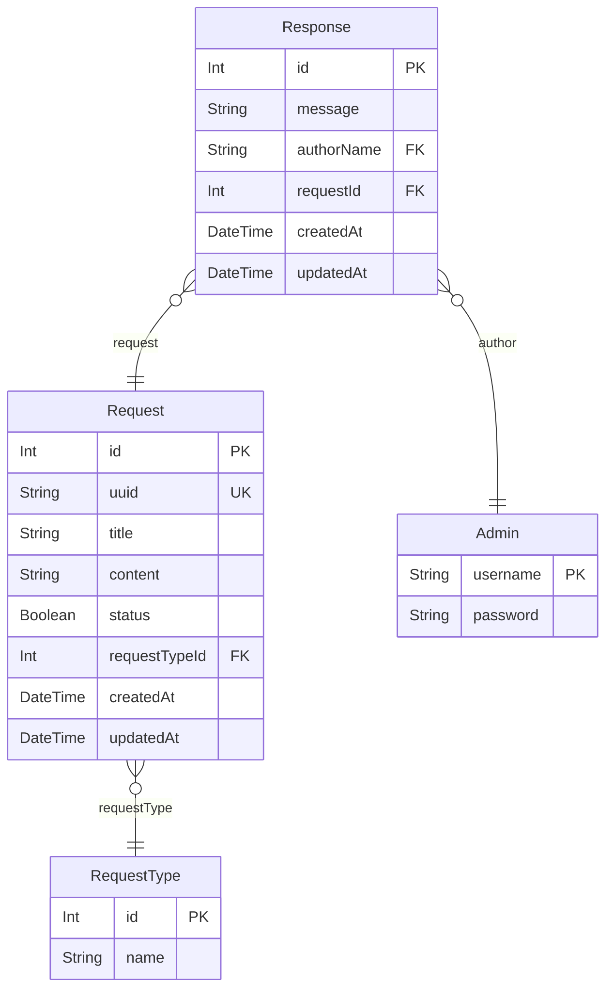

# Sayem Yazılım geliştirici 5 projesi
SERKAN DAYICIK

### Bağımlılıklar

Proje, [NodeJS v20.10.0](https://nodejs.org/en) LTS versiyonunu ve MySQL veya MariaDB gerektirir. Ayrıca, IIS Server için NodeJS ve proje dosya yollarına geçerli okuma ve yazma izinleri verilmiş olmalıdır. IIS için [HttpPlatformHandler v1.2](https://www.iis.net/downloads/microsoft/httpplatformhandler) modülü de gereklidir.

Proje bağımlılıkları ve açıklamaları aşağıda belirtilmiştir ve bunlar `package.json` üzerinden kurulabilir:

* `@prisma/client: "^5.7.0",` Prisma ORM frameworkü client
* `bcrypt": "^5.1.1,` Yetkili authentication mekanizması için şifre encrypt kütüphanesi
* `body-parser": "^1.20.2` Express içerisin de gelen requestleri bodyden parse etme kütüphanesi
* `dotenv": "^16.3.1` env verilerini tek dosya içerisinde NodeJS ortamına aktarmak için kütüphane
* `ejs": "^3.1.9` Express içerisin de view html template kütüphanesi
* `express": "^4.18.2` Node.js tabanlı bir web uygulama sunucu çatısıdır ve projemizin temelini oluşturur
* `express-ejs-layouts` URL bazlı alanlara farklı layoutlar servis etmemizi sağlayan kütüphane
* `express-session": "^1.17.3` Express içerisin de session tutmamızı sağlayan kütüphane
* `memorystore": "^1.6.7` Session memory store kütüphanesi
* `uuid": "^9.0.1` Her bir talep için benzersiz bir kimlik oluşturan kütüphane

Sadece geliştirme ortamı üzerinde kullanılan kütüphaneler

* `nodemon": "^3.0.2` Projemizi geliştirme ortamı üzerinde sürekli izleyen ve dosyalar da değişiklikleri tespit edip live reload server kütüphanesi
* `prisma": "^5.7.0` Projemizin Database ORM Framework kütüphanesi


## Uyarı
> `.env.example` dosyasındaki PORT ve Database değişkenleri ayarlanmalı ve ardından dosya adı `.env` olarak değiştirilmelidir.

## 💾 Geliştirme Ortamı Kurulumu
Geliştirme ortamı içinde nodemon ile sunucu başlatılır ve yapılan değişiklikler anlık olarak yansıtılır:

```shell
npm install

npx prisma db push
npx prisma db seed

npm run dev
```

## 💾 Üretim Ortamı Kurulumu
Üretim ortamında IIS Server kullanılır ve çevre değişkeni olarak "production" gönderilir; bu ayarlama `web.config` dosyasında yapılmıştır

```shell
npm install

npx prisma db push
npx prisma db seed
```

## 💾 Örnek Üretim Ortamı
Heroku üzerinde SSL ile birlikte üretim ortamında çalışan uygulama ücretsiz paket olduğu için biraz yavaş olabilir

[Prod Uygulama](https://rocky-temple-56475-2dff71268dba.herokuapp.com/)

## 📓 Veritabanı Varlık İlişki Diyagramı (ERD)



### `Request(Talep)`

**Properties**
  - `id`: Primary Key INT
  - `uuid`: Unique Key server tarafında generate edilir STRING
  - `title`: Talep başlık STRING(191).
  - `content`: Talep içerik LONGTEXT
  - `status`: Talep durumu BOOLEAN
  - `requestTypeId`: Talep türü Foreign Key INT
  - `createdAt`: Talep oluşturulma tarihi DATETIME
  - `updatedAt`: Talep Düzenleme tarihi DATETIME

### `RequestType(Talep Türü)`

**Properties**
  - `id`: Primary Key INT
  - `name`: Talep türü STRING(191)

### `Admin(Yetkili)`

**Properties**
  - `username`: Primary Key STRING
  - `password`: Şifre STRING

### `Response(Cevap)`

**Properties**
  - `id`: Primary Key INT
  - `message`: Cevap mesajı LONGTEXT
  - `authorName`: Cevap veren yetkili username Foreign Key STRING
  - `requestId`: Talep ID Foreign Key INT
  - `createdAt`: Talep oluşturulma tarihi DATETIME
  - `updatedAt`: Talep Düzenleme tarihi DATETIME
