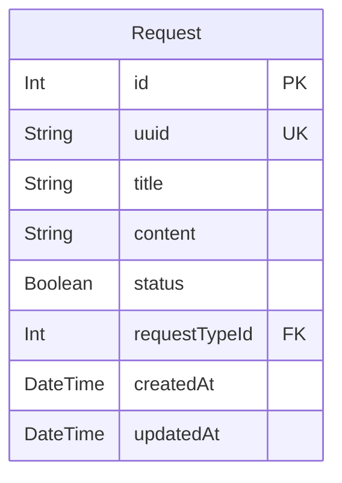
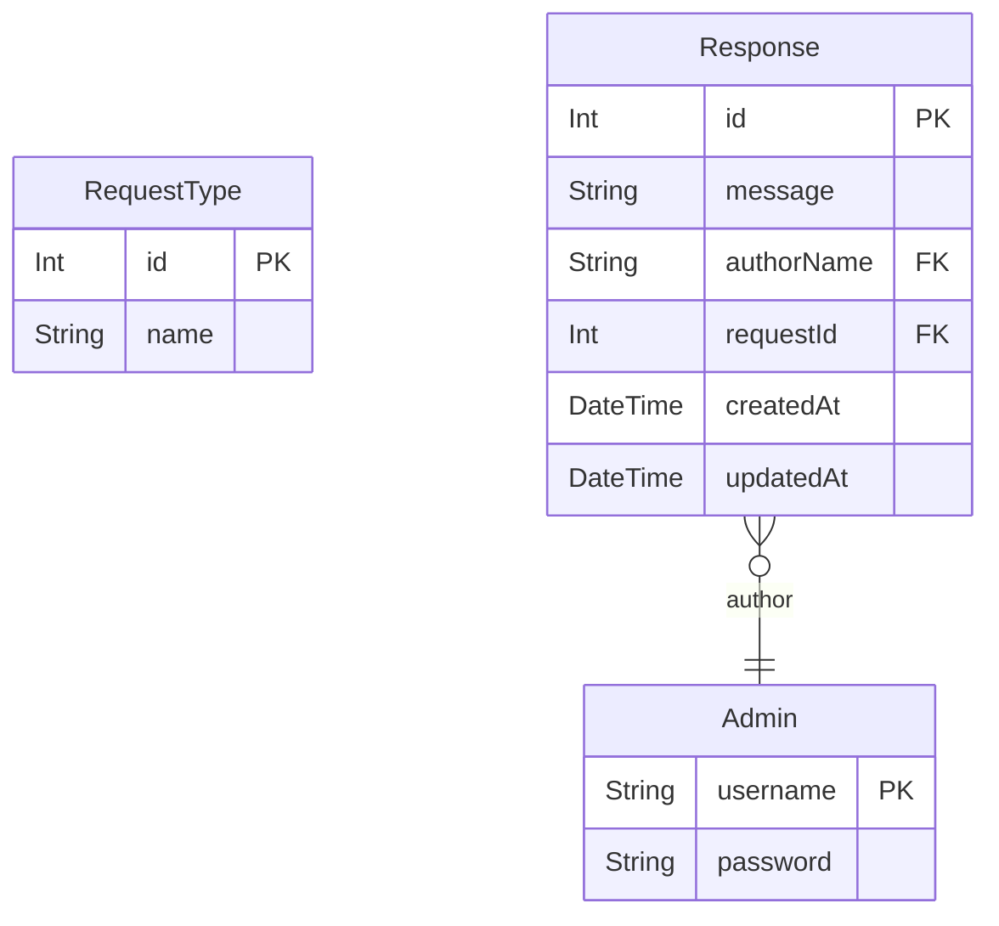

# Shopping Mall
> Generated by [`prisma-markdown`](https://github.com/samchon/prisma-markdown)

- [Articles](#Articles)
- [default](#default)

## Articles

### `Request`
Attachment File.

Every attachment files that are managed in this shopping mall system.

For reference, it is possible to omit one of file name or extension like 
`.gitignore` or `README` case, but not possible to omit both of them,

**Properties**
  - `id`: 
  - `uuid`: 
  - `title`: 
  - `content`: 
  - `status`: 
  - `requestTypeId`: 
  - `createdAt`: 
  - `updatedAt`: 

## default

### `RequestType`

**Properties**
  - `id`: 
  - `name`: 

### `Admin`

**Properties**
  - `username`: 
  - `password`: 

### `Response`

**Properties**
  - `id`: 
  - `message`: 
  - `authorName`: 
  - `requestId`: 
  - `createdAt`: 
  - `updatedAt`: 