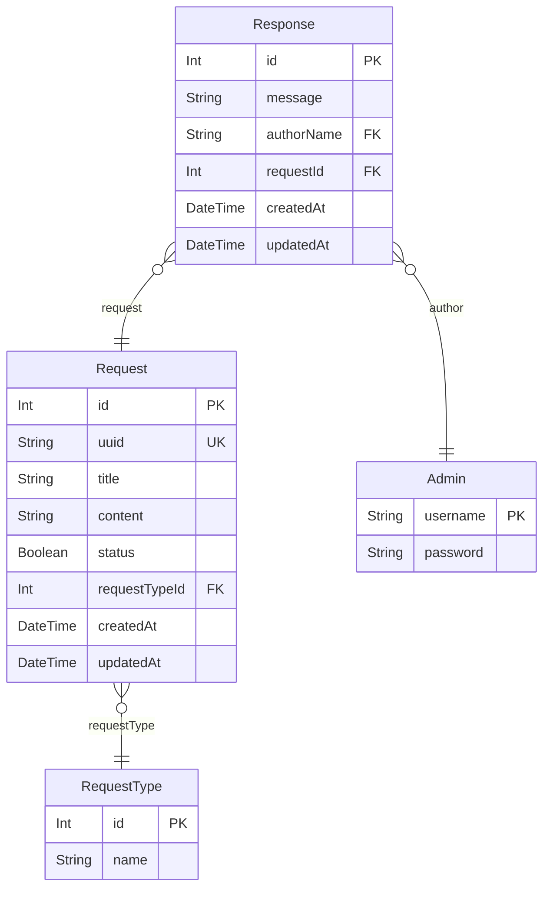

# SAYEM Yazılım Geliştirici 5 Database Entity Relationship Diagram

- [default](#default)

## default

### `Request`

**Properties**
  - `id`: 
  - `uuid`: 
  - `title`: 
  - `content`: 
  - `status`: 
  - `requestTypeId`: 
  - `createdAt`: 
  - `updatedAt`: 

### `RequestType`

**Properties**
  - `id`: 
  - `name`: 

### `Admin`

**Properties**
  - `username`: 
  - `password`: 

### `Response`

**Properties**
  - `id`: 
  - `message`: 
  - `authorName`: 
  - `requestId`: 
  - `createdAt`: 
  - `updatedAt`: 