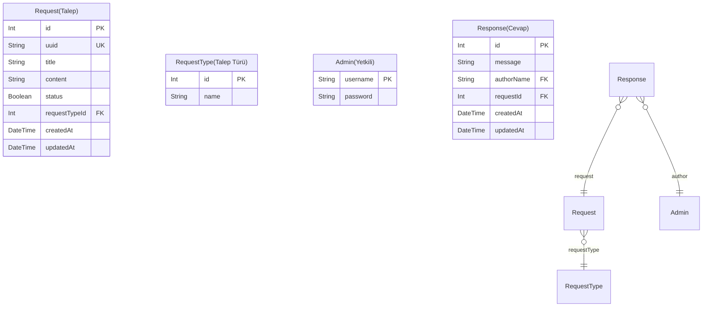

# SAYEM Yazılım Geliştirici 5 Database Entity Relationship Diagram

### `Request(Talep)`

**Properties**
  - `id`: 
  - `uuid`: 
  - `title`: 
  - `content`: 
  - `status`: 
  - `requestTypeId`: 
  - `createdAt`: 
  - `updatedAt`: 

### `RequestType(Talep Türü)`

**Properties**
  - `id`: 
  - `name`: 

### `Admin(Yetkili)`

**Properties**
  - `username`: 
  - `password`: 

### `Response(Cevap)`

**Properties**
  - `id`: 
  - `message`: 
  - `authorName`: 
  - `requestId`: 
  - `createdAt`: 
  - `updatedAt`: 